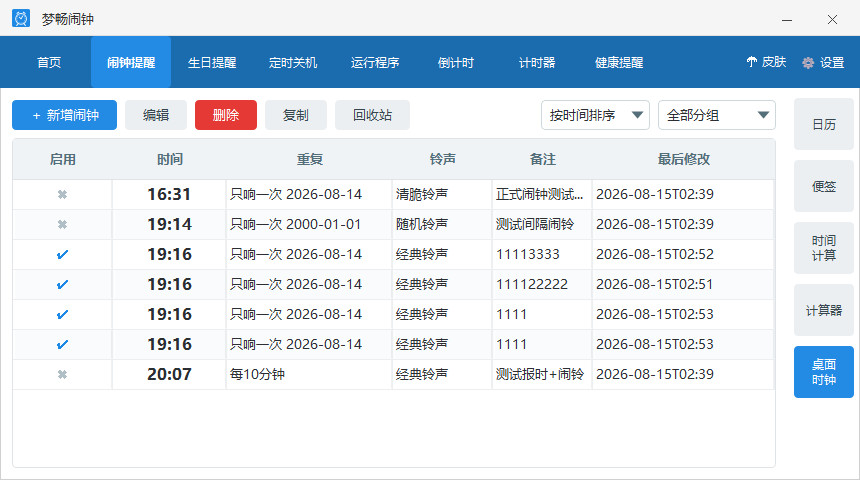
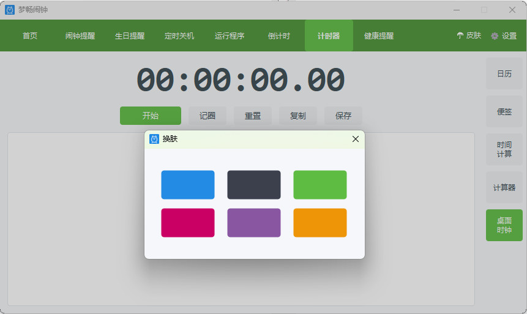
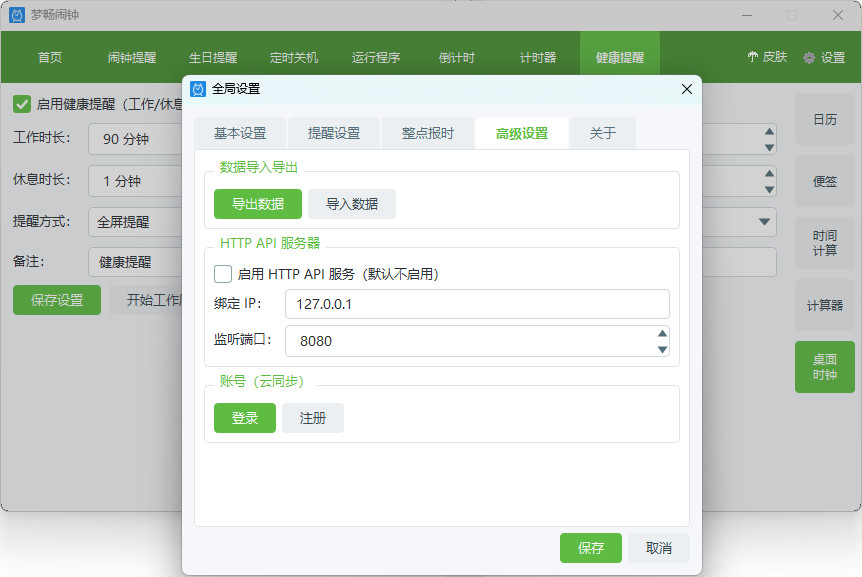
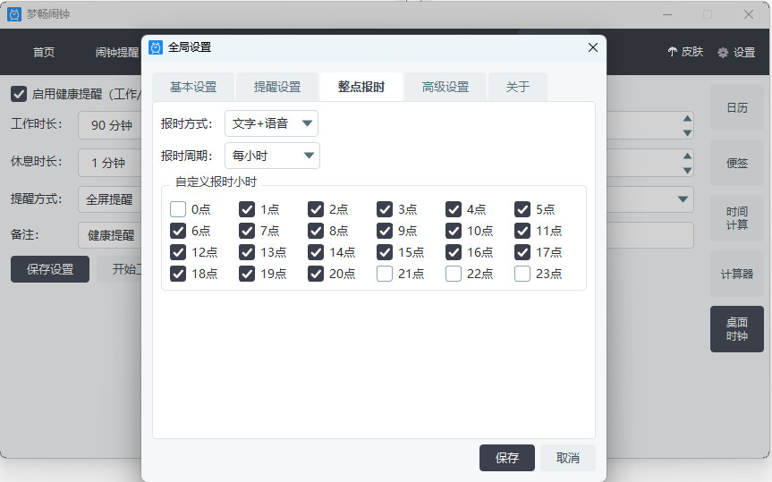

# MCClock梦畅闹钟

MCClock梦畅闹钟是一款采用C++ Qt框架开发的多功能闹钟软件，支持CLI命令行接口和HTTP API接口，提供丰富的定时提醒功能，开源免费。


## 功能特性

### 主要功能模块

| 模块 | 功能说明 |
|------|----------|
| **首页** | 实时显示当前时间、日期、农历、生肖、星座及运行时长 |
| **闹钟提醒** | 支持多种周期模式（单次/每日/每周/每月/每年/自定义间隔），支持分组管理、回收站功能 |
| **生日提醒** | 支持公历/农历生日设置，支持提前N天提醒 |
| **定时关机** | 支持强制关机/正常关机/重启/注销，可设置提前秒数 |
| **定时运行** | 定时启动指定程序，支持自定义参数 |
| **倒计时** | 支持时长倒计时和目标时间倒计时 |
| **秒表** | 支持开始/暂停/停止/记录圈数 |
| **健康提醒** | 久坐提醒，可设置工作/休息时长，支持全屏提醒模式 |
| **换肤** | 6种纯色皮肤主题，支持实时切换 |
| **便签** | 桌面便签功能 |
| **桌面时钟** | 桌面悬浮时钟 |

### 全局设置

- **基本设置**：开机自动启动、启动时提醒遗漏闹钟、自动检查更新、显示桌面时钟
- **提醒设置**：全屏提醒模式/时间段、提醒位置、关闭模式、音量控制
- **整点报时**：报时模式、报时周期、自定义报时小时
- **高级设置**：HTTP API接口开关、数据导入导出
- **关于**：软件介绍、官方仓库链接

## 界面预览






## 安装与运行

### 系统要求
- Windows 10/11 (64位)
- 无需安装Qt运行时（已内置）

### 运行方式
1. 解压发布包到任意目录
2. 双击运行 `MCClock.exe`

## 数据存储

### 默认路径
- **数据库文件**：`%APPDATA%/MCClock/MCClock/mcclock.db`
- **配置文件**：`%APPDATA%/MCClock/MCClock/settings.json`

### SQLite数据库表结构

#### schema_version
| 字段 | 类型 | 说明 |
|------|------|------|
| version | INTEGER | 数据库版本号 |

#### alarm_groups
| 字段 | 类型 | 说明 |
|------|------|------|
| uuid | TEXT PRIMARY KEY | 唯一标识 |
| sync_status | INTEGER | 同步状态 |
| last_modified | TEXT | 最后修改时间 |
| created_at | TEXT | 创建时间 |
| name | TEXT | 分组名称 |
| sort_order | INTEGER | 排序顺序 |

#### alarms
| 字段 | 类型 | 说明 |
|------|------|------|
| uuid | TEXT PRIMARY KEY | 唯一标识 |
| sync_status | INTEGER | 同步状态 |
| last_modified | TEXT | 最后修改时间 |
| created_at | TEXT | 创建时间 |
| enabled | INTEGER | 是否启用 |
| cycle_mode | INTEGER | 周期模式 |
| cycle_data | TEXT | 周期参数(JSON) |
| time | TEXT | 触发时间(HH:mm) |
| range_start | TEXT | 范围开始日期 |
| range_end | TEXT | 范围结束日期 |
| ringtone | INTEGER | 铃声ID |
| custom_ringtone_path | TEXT | 自定义铃声路径 |
| ring_mode | INTEGER | 响铃模式 |
| custom_minutes | INTEGER | 自定义响铃时长(分钟) |
| label | TEXT | 标签 |
| group_id | TEXT | 分组ID |
| deleted | INTEGER | 是否已删除(回收站) |

#### birthdays
| 字段 | 类型 | 说明 |
|------|------|------|
| uuid | TEXT PRIMARY KEY | 唯一标识 |
| sync_status | INTEGER | 同步状态 |
| last_modified | TEXT | 最后修改时间 |
| created_at | TEXT | 创建时间 |
| name | TEXT | 姓名 |
| gender | INTEGER | 性别(0未知/1男/2女) |
| is_lunar | INTEGER | 是否农历 |
| solar_year | INTEGER | 公历年 |
| solar_month | INTEGER | 公历月 |
| solar_day | INTEGER | 公历日 |
| lunar_month | INTEGER | 农历月 |
| lunar_day | INTEGER | 农历日 |
| remind_time | TEXT | 提醒时间 |
| advance_days | INTEGER | 提前天数 |
| ringtone | INTEGER | 铃声ID |
| custom_ringtone_path | TEXT | 自定义铃声路径 |
| ring_mode | INTEGER | 响铃模式 |
| custom_minutes | INTEGER | 自定义响铃时长 |
| avatar_path | TEXT | 头像路径 |
| label | TEXT | 标签 |

#### shutdown_tasks
| 字段 | 类型 | 说明 |
|------|------|------|
| uuid | TEXT PRIMARY KEY | 唯一标识 |
| sync_status | INTEGER | 同步状态 |
| last_modified | TEXT | 最后修改时间 |
| created_at | TEXT | 创建时间 |
| enabled | INTEGER | 是否启用 |
| cycle_mode | INTEGER | 周期模式 |
| cycle_data | TEXT | 周期参数(JSON) |
| time | TEXT | 触发时间 |
| range_start | TEXT | 范围开始日期 |
| range_end | TEXT | 范围结束日期 |
| shutdown_option | INTEGER | 关机选项 |
| advance_seconds | INTEGER | 提前秒数 |
| label | TEXT | 标签 |

#### run_program_tasks
| 字段 | 类型 | 说明 |
|------|------|------|
| uuid | TEXT PRIMARY KEY | 唯一标识 |
| sync_status | INTEGER | 同步状态 |
| last_modified | TEXT | 最后修改时间 |
| created_at | TEXT | 创建时间 |
| enabled | INTEGER | 是否启用 |
| cycle_mode | INTEGER | 周期模式 |
| cycle_data | TEXT | 周期参数(JSON) |
| time | TEXT | 触发时间 |
| range_start | TEXT | 范围开始日期 |
| range_end | TEXT | 范围结束日期 |
| program_path | TEXT | 程序路径 |
| arguments | TEXT | 程序参数 |
| ring_enabled | INTEGER | 是否启用铃声 |
| label | TEXT | 标签 |

#### countdowns
| 字段 | 类型 | 说明 |
|------|------|------|
| uuid | TEXT PRIMARY KEY | 唯一标识 |
| sync_status | INTEGER | 同步状态 |
| last_modified | TEXT | 最后修改时间 |
| created_at | TEXT | 创建时间 |
| enabled | INTEGER | 是否启用 |
| mode | INTEGER | 模式(0时长/1目标时间) |
| total_seconds | INTEGER | 总秒数 |
| target_datetime | TEXT | 目标时间 |
| remaining_seconds | INTEGER | 剩余秒数 |
| ringtone | INTEGER | 铃声ID |
| custom_ringtone_path | TEXT | 自定义铃声路径 |
| ring_mode | INTEGER | 响铃模式 |
| custom_minutes | INTEGER | 自定义响铃时长 |
| label | TEXT | 标签 |

#### health_settings
| 字段 | 类型 | 说明 |
|------|------|------|
| uuid | TEXT PRIMARY KEY | 唯一标识 |
| sync_status | INTEGER | 同步状态 |
| last_modified | TEXT | 最后修改时间 |
| created_at | TEXT | 创建时间 |
| enabled | INTEGER | 是否启用 |
| display_mode | INTEGER | 显示模式 |
| work_minutes | INTEGER | 工作时长(分钟) |
| rest_minutes | INTEGER | 休息时长(分钟) |
| ringtone | INTEGER | 铃声ID |
| custom_ringtone_path | TEXT | 自定义铃声路径 |
| ring_mode | INTEGER | 响铃模式 |
| custom_minutes | INTEGER | 自定义响铃时长 |
| label | TEXT | 标签 |

## CLI命令行接口

### 基本用法
```
MCClock-CLI.exe <module> <action> [options]
```

### 模块说明

#### alarm - 闹钟管理

| 操作 | 说明 | 示例 |
|------|------|------|
| `list` | 列出所有闹钟 | `MCClock-CLI alarm list` |
| `list --group <uuid>` | 按分组筛选闹钟 | `MCClock-CLI alarm list --group <uuid>` |
| `list --json` | JSON格式输出 | `MCClock-CLI alarm list --json` |
| `add` | 添加闹钟 | `MCClock-CLI alarm add --time 07:30 --label "起床" --cycle daily` |
| `edit` | 编辑闹钟 | `MCClock-CLI alarm edit --uuid <uuid> --time 08:00` |
| `delete` | 删除闹钟(移到回收站) | `MCClock-CLI alarm delete --uuid <uuid>` |
| `enable` | 启用闹钟 | `MCClock-CLI alarm enable --uuid <uuid>` |
| `disable` | 禁用闹钟 | `MCClock-CLI alarm disable --uuid <uuid>` |
| `deleted` | 列出回收站 | `MCClock-CLI alarm deleted` |
| `restore` | 恢复闹钟 | `MCClock-CLI alarm restore --uuid <uuid>` |
| `purge` | 彻底删除 | `MCClock-CLI alarm purge --uuid <uuid>` |
| `clear-recycle` | 清空回收站 | `MCClock-CLI alarm clear-recycle --yes` |
| `export` | 导出到JSON | `MCClock-CLI alarm export --file alarms.json` |
| `import` | 从JSON导入 | `MCClock-CLI alarm import --file alarms.json` |
| `copy` | 复制闹钟 | `MCClock-CLI alarm copy --uuid <uuid> --label "副本"` |
| `list-groups` | 列出所有分组 | `MCClock-CLI alarm list-groups` |
| `add-group` | 创建新分组 | `MCClock-CLI alarm add-group --add-group "工作"` |
| `rename-group` | 重命名分组 | `MCClock-CLI alarm rename-group --uuid <uuid> --rename-group "新名"` |
| `remove-group` | 删除分组 | `MCClock-CLI alarm remove-group --uuid <uuid> --yes` |

**闹钟选项：**
- `--time <HH:mm>` - 触发时间
- `--label <text>` - 标签
- `--cycle <mode>` - 周期模式：once/daily/weekly/monthly/yearly/interval
- `--cycle-data <json>` - 周期参数（JSON格式）
- `--ringtone <id>` - 铃声ID (1-8, 7=随机, 8=自定义)
- `--ring-mode <m>` - 响铃模式：announce/continuous/once/silent/custom
- `--custom-minutes <n>` - 自定义响铃时长(分钟)
- `--group <uuid>` - 闹钟分组UUID

#### birthday - 生日管理

| 操作 | 说明 | 示例 |
|------|------|------|
| `list` | 列出所有生日 | `MCClock-CLI birthday list` |
| `add` | 添加生日 | `MCClock-CLI birthday add --name "妈妈" --date 1965-03-20 --gender female` |
| `edit` | 编辑生日 | `MCClock-CLI birthday edit --uuid <uuid> --date 03-20` |
| `delete` | 删除生日 | `MCClock-CLI birthday delete --uuid <uuid>` |
| `export` | 导出到JSON | `MCClock-CLI birthday export --file birthdays.json` |
| `import` | 从JSON导入 | `MCClock-CLI birthday import --file birthdays.json` |

**生日选项：**
- `--name <text>` - 姓名
- `--date <d>` - 日期 (yyyy-MM-dd 或 MM-dd)
- `--lunar` - 将日期视为农历
- `--gender <g>` - 性别：male/female

#### shutdown - 定时关机

| 操作 | 说明 | 示例 |
|------|------|------|
| `list` | 列出所有任务 | `MCClock-CLI shutdown list` |
| `add` | 添加任务 | `MCClock-CLI shutdown add --time 23:00 --option shutdown` |
| `edit` | 编辑任务 | `MCClock-CLI shutdown edit --uuid <uuid> --option restart` |
| `delete` | 删除任务 | `MCClock-CLI shutdown delete --uuid <uuid>` |
| `run` | 立即执行 | `MCClock-CLI shutdown run --uuid <uuid> --yes` |

**关机选项：**
- `--option <o>` - force-shutdown/shutdown/restart/logoff
- `--advance <n>` - 提前秒数

#### run - 定时运行程序

| 操作 | 说明 | 示例 |
|------|------|------|
| `list` | 列出所有任务 | `MCClock-CLI run list` |
| `add` | 添加任务 | `MCClock-CLI run add --time 09:00 --path "C:\app.exe"` |
| `edit` | 编辑任务 | `MCClock-CLI run edit --uuid <uuid> --path "D:\new.exe"` |
| `delete` | 删除任务 | `MCClock-CLI run delete --uuid <uuid>` |
| `run` | 立即执行 | `MCClock-CLI run run --uuid <uuid>` |
| `copy` | 复制任务 | `MCClock-CLI run copy --uuid <uuid> --label "副本"` |

**运行选项：**
- `--path <p>` - 程序路径
- `--args <a>` - 程序参数
- `--time <HH:mm>` - 执行时间
- `--cycle <mode>` - 周期模式：once/daily/weekly/interval
- `--cycle-data <json>` - 周期参数（JSON格式，间隔模式支持时分秒和限制条件）
- `--label <text>` - 备注

#### countdown - 倒计时

| 操作 | 说明 | 示例 |
|------|------|------|
| `list` | 列出所有倒计时 | `MCClock-CLI countdown list` |
| `add` | 添加倒计时 | `MCClock-CLI countdown add --minutes 30 --label "休息"` |
| `edit` | 编辑倒计时 | `MCClock-CLI countdown edit --uuid <uuid> --minutes 60` |
| `delete` | 删除倒计时 | `MCClock-CLI countdown delete --uuid <uuid>` |

**倒计时选项：**
- `--minutes <n>` - 倒计时分钟数
- `--target <dt>` - 目标时间 (ISO8601格式)

#### health - 健康提醒

| 操作 | 说明 | 示例 |
|------|------|------|
| `get` | 查看设置 | `MCClock-CLI health get` |
| `set` | 修改设置 | `MCClock-CLI health set enable work=30 rest=5` |
| `enable` | 启用 | `MCClock-CLI health enable` |
| `disable` | 禁用 | `MCClock-CLI health disable` |

**健康设置选项：**
- `enable` - 启用
- `work=<n>` - 工作时长(分钟)
- `rest=<n>` - 休息时长(分钟)

#### settings - 应用设置

| 操作 | 说明 | 示例 |
|------|------|------|
| `get` | 获取设置值 | `MCClock-CLI settings get reminder.volume` |
| `set` | 设置值 | `MCClock-CLI settings set reminder.volume 80` |
| `list` | 列出所有设置 | `MCClock-CLI settings list` |

#### system - 系统操作

| 操作 | 说明 | 示例 |
|------|------|------|
| `info` | 系统信息 | `MCClock-CLI system info` |
| `autostart on/off` | 开机自启 | `MCClock-CLI system autostart on` |
| `shutdown` | 立即关机 | `MCClock-CLI system shutdown --yes` |
| `restart` | 立即重启 | `MCClock-CLI system restart --yes` |
| `logoff` | 立即注销 | `MCClock-CLI system logoff --yes` |
| `backup` | 备份数据 | `MCClock-CLI system backup --file backup.zip` |
| `restore` | 恢复数据 | `MCClock-CLI system restore --file backup.zip --yes` |

## HTTP API接口

### 启用方式
在全局设置 → 高级设置中开启HTTP API接口，配置绑定IP和端口（默认 `0.0.0.0:8080`）。

### 通用响应格式
```json
{
  "code": 0,
  "message": "success",
  "data": { ... }
}
```

### 接口列表

#### 系统状态

**GET /api/v1/status** - 获取系统状态

响应示例：
```json
{
  "code": 0,
  "message": "success",
  "data": {
    "app": "MCClock",
    "version": "1.0.0",
    "time": "2026-08-12T09:00:00"
  }
}
```

#### 设置管理

**GET /api/v1/settings** - 获取所有设置

**PUT /api/v1/settings** - 更新设置

请求示例：
```bash
curl -X PUT http://localhost:8080/api/v1/settings \
  -H "Content-Type: application/json" \
  -d '{"reminder": {"volume": 80}}'
```

#### 闹钟管理

**GET /api/v1/alarms** - 获取所有闹钟

**POST /api/v1/alarms** - 创建闹钟

请求示例：
```bash
curl -X POST http://localhost:8080/api/v1/alarms \
  -H "Content-Type: application/json" \
  -d '{
    "time": "07:30",
    "label": "起床",
    "enabled": true,
    "cycleMode": 1,
    "ringtone": 1,
    "ringMode": 0
  }'
```

**PUT /api/v1/alarms** - 更新闹钟

**DELETE /api/v1/alarms/{uuid}** - 删除闹钟（移到回收站）

**GET /api/v1/alarms/deleted** - 获取回收站闹钟

**POST /api/v1/alarms/restore/{uuid}** - 恢复闹钟

**POST /api/v1/alarms/purge/{uuid}** - 彻底删除闹钟

**POST /api/v1/alarms/clear-recycle** - 清空回收站

**POST /api/v1/alarms/copy/{uuid}** - 复制闹钟

请求示例：
```bash
curl -X POST http://localhost:8080/api/v1/alarms/copy/<uuid> \
  -H "Content-Type: application/json" \
  -d '{"label": "副本"}'
```

响应示例：
```json
{
  "code": 0,
  "message": "success",
  "data": {
    "uuid": "new-uuid...",
    "time": "07:30",
    "label": "副本",
    "cycleMode": 1,
    "enabled": true
  }
}
```

#### 闹钟分组管理

**GET /api/v1/alarm-groups** - 获取所有分组

响应示例：
```json
{
  "code": 0,
  "message": "success",
  "data": [
    {
      "uuid": "default",
      "name": "默认",
      "sortOrder": 0,
      "createdAt": "2026-08-12T00:00:00"
    }
  ]
}
```

**POST /api/v1/alarm-groups** - 创建分组

请求示例：
```bash
curl -X POST http://localhost:8080/api/v1/alarm-groups \
  -H "Content-Type: application/json" \
  -d '{"name": "工作"}'
```

**PUT /api/v1/alarm-groups/{uuid}** - 更新分组

请求示例：
```bash
curl -X PUT http://localhost:8080/api/v1/alarm-groups/<uuid> \
  -H "Content-Type: application/json" \
  -d '{"name": "新名称"}'
```

**DELETE /api/v1/alarm-groups/{uuid}** - 删除分组（分组下闹钟自动移到默认分组）

#### 生日管理

**GET /api/v1/birthdays** - 获取所有生日

**POST /api/v1/birthdays** - 创建生日

请求示例：
```bash
curl -X POST http://localhost:8080/api/v1/birthdays \
  -H "Content-Type: application/json" \
  -d '{
    "name": "妈妈",
    "solarMonth": 3,
    "solarDay": 20,
    "gender": 2,
    "remindTime": "08:00",
    "advanceDays": 1
  }'
```

**PUT /api/v1/birthdays** - 更新生日

**DELETE /api/v1/birthdays/{uuid}** - 删除生日

#### 定时关机

**GET /api/v1/shutdown-tasks** - 获取所有关机任务

**POST /api/v1/shutdown-tasks** - 创建关机任务

请求示例：
```bash
curl -X POST http://localhost:8080/api/v1/shutdown-tasks \
  -H "Content-Type: application/json" \
  -d '{
    "time": "23:00",
    "enabled": true,
    "shutdownOption": 1,
    "advanceSeconds": 30
  }'
```

**PUT /api/v1/shutdown-tasks** - 更新关机任务

**DELETE /api/v1/shutdown-tasks/{uuid}** - 删除关机任务

**POST /api/v1/shutdown-tasks/{uuid}/run** - 立即执行关机任务

#### 定时运行程序

**GET /api/v1/run-programs** - 获取所有运行任务

**POST /api/v1/run-programs** - 创建运行任务

请求示例：
```bash
curl -X POST http://localhost:8080/api/v1/run-programs \
  -H "Content-Type: application/json" \
  -d '{
    "time": "09:00",
    "enabled": true,
    "programPath": "C:\\Windows\\notepad.exe",
    "arguments": ""
  }'
```

**PUT /api/v1/run-programs** - 更新运行任务

**DELETE /api/v1/run-programs/{uuid}** - 删除运行任务

**POST /api/v1/run-programs/{uuid}/run** - 立即执行程序

**POST /api/v1/run-programs/copy/{uuid}** - 复制运行任务

请求示例：
```bash
curl -X POST http://localhost:8080/api/v1/run-programs/copy/<uuid> \
  -H "Content-Type: application/json" \
  -d '{"label": "副本"}'
```

响应示例：
```json
{
  "code": 0,
  "message": "success",
  "data": {
    "uuid": "new-uuid...",
    "time": "09:00",
    "programPath": "C:\\Windows\\notepad.exe",
    "label": "副本",
    "cycleMode": 1,
    "enabled": true
  }
}
```

间隔模式周期参数示例（cycle_data JSON）：
```json
{
  "interval_hours": 0,
  "interval_minutes": 5,
  "interval_seconds": 0,
  "restrict_weekdays": [1, 3, 5],
  "restrict_start": "2026-08-01",
  "restrict_end": "2026-08-31"
}
```
- `interval_hours`/`interval_minutes`/`interval_seconds` - 间隔时长
- `restrict_weekdays` - 星期限制（1=周一..7=周日，可选，空数组表示无限制）
- `restrict_start`/`restrict_end` - 日期范围限制（可选，空字符串表示无限制）

#### 倒计时

**GET /api/v1/countdowns** - 获取所有倒计时

**POST /api/v1/countdowns** - 创建倒计时

请求示例：
```bash
curl -X POST http://localhost:8080/api/v1/countdowns \
  -H "Content-Type: application/json" \
  -d '{
    "label": "休息",
    "mode": 0,
    "totalSeconds": 1800,
    "enabled": true
  }'
```

**PUT /api/v1/countdowns** - 更新倒计时

**DELETE /api/v1/countdowns/{uuid}** - 删除倒计时

#### 秒表控制

**GET /api/v1/stopwatch/status** - 获取秒表状态

响应示例：
```json
{
  "code": 0,
  "message": "success",
  "data": {
    "state": "running",
    "elapsedMs": 65432,
    "laps": [12345, 23456]
  }
}
```

**POST /api/v1/stopwatch/start** - 开始秒表

**POST /api/v1/stopwatch/pause** - 暂停秒表

**POST /api/v1/stopwatch/stop** - 停止秒表

**POST /api/v1/stopwatch/reset** - 重置秒表

**POST /api/v1/stopwatch/lap** - 记录圈数

#### 健康设置

**GET /api/v1/health** - 获取健康设置

**PUT /api/v1/health** - 更新健康设置

请求示例：
```bash
curl -X PUT http://localhost:8080/api/v1/health \
  -H "Content-Type: application/json" \
  -d '{
    "enabled": true,
    "workMinutes": 45,
    "restMinutes": 5
  }'
```

## 构建说明

### 环境要求
- Visual Studio 2022 或更高版本
- Qt 6.8.3 (msvc2022_64)
- CMake 3.25+

### 构建步骤
```bash
# 配置
cmake -S . -B build -G "Visual Studio 18 2026" -A x64

# 编译
cmake --build build --config Release

# 部署打包
pwsh tools/deploy.ps1
```

## 开源协议

本项目采用 MIT 开源协议。

## 官方仓库

https://github.com/hexiyou/MCClock
